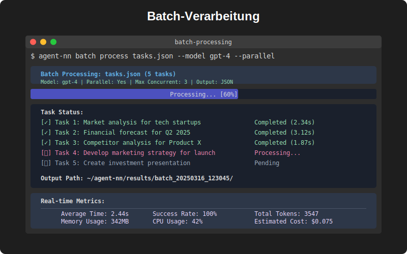
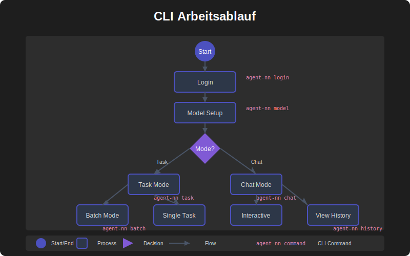
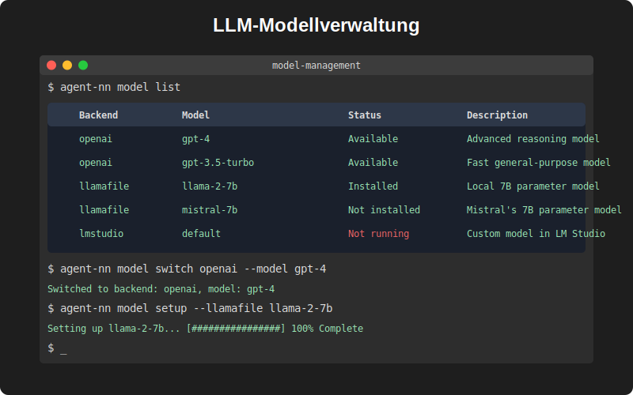

# Agent-NN Command Line Interface

## Inhaltsverzeichnis

1. [Einführung](#einführung)
2. [Installation](#installation)
3. [Erste Schritte](#erste-schritte)
4. [Grundlegende Befehle](#grundlegende-befehle)
5. [Aufgabenausführung](#aufgabenausführung)
6. [Interaktiver Chat-Modus](#interaktiver-chat-modus)
7. [Modellverwaltung](#modellverwaltung)
8. [Batch-Verarbeitung](#batch-verarbeitung)
9. [Performance-Überwachung](#performance-überwachung)
10. [Fortgeschrittene Funktionen](#fortgeschrittene-funktionen)
11. [Fehlerbehebung](#fehlerbehebung)
12. [Referenz](#referenz)

## Einführung

Die Agent-NN Command Line Interface (CLI) ist ein leistungsstarkes Werkzeug, das direkten Zugriff auf das Agent-NN-System über die Kommandozeile ermöglicht. Sie bietet alle Kernfunktionen der Web-Oberfläche und zusätzliche Automatisierungs- und Integrationsmöglichkeiten für fortgeschrittene Benutzer.

Die CLI ist ideal für:
- Automatisierte Workflows und Skripte
- Integration in bestehende Systeme
- Batch-Verarbeitung von Aufgaben
- Leistungsüberwachung und -optimierung
- Modell- und Systemkonfiguration


## Installation

### Modell wechseln

```bash
agent-nn model switch <backend> --model <modellname>
```

Beispiele:
```bash
agent-nn model switch openai --model gpt-4
agent-nn model switch llamafile --model llama-2-7b
```

### Modelle einrichten und herunterladen

Für lokale Modelle wie llamafile können Sie die Einrichtung automatisieren:

```bash
agent-nn model setup --llamafile <modell-oder-all>
```

Beispiele:
```bash
agent-nn model setup --llamafile llama-2-7b
agent-nn model setup --llamafile all
```

Für LM Studio-Modelle:
```bash
agent-nn model setup --lmstudio
```

### Modell testen

Testen Sie schnell ein Modell mit einem Beispielprompt:

```bash
agent-nn model test --prompt "Erkläre mir künstliche Intelligenz in einfachen Worten"
```

Optionen:
- `--backend`: Backend für den Test
- `--model`: Spezifisches Modell für den Test
- `--verbose`: Ausführliche Ausgabe mit Tokenverbrauch und Zeitinformationen

## Batch-Verarbeitung

Die Batch-Verarbeitung ermöglicht die Ausführung mehrerer Aufgaben in einem Durchgang, was besonders für wiederkehrende oder groß angelegte Verarbeitungen nützlich ist.

### Batch-Verarbeitung ausführen

```bash
agent-nn batch process <eingabedatei> [optionen]
```

Die Eingabedatei kann im JSON- oder CSV-Format vorliegen:

**JSON-Format Beispiel (tasks.json):**
```json
{
  "tasks": [
    {
      "description": "Marktanalyse für Tech-Startups erstellen",
      "domain": "finance",
      "priority": 2
    },
    {
      "description": "Finanzprognose für Q2 2025 erstellen",
      "domain": "finance",
      "priority": 1
    },
    {
      "description": "Wettbewerbsanalyse für Produkt X durchführen",
      "domain": "marketing",
      "priority": 3
    }
  ]
}
```

**CSV-Format Beispiel (tasks.csv):**
```csv
description,domain,priority
"Marktanalyse für Tech-Startups erstellen",finance,2
"Finanzprognose für Q2 2025 erstellen",finance,1
"Wettbewerbsanalyse für Produkt X durchführen",marketing,3
```

Optionen:
- `--parallel`: Führt Aufgaben parallel aus (Standard: true)
- `--max-concurrent`: Maximale Anzahl gleichzeitiger Aufgaben (Standard: 3)
- `--output-format`: Format der Ausgabedateien (json, csv, yaml)
- `--output-dir`: Verzeichnis für Ausgabedateien



### Batch-Status überwachen

Während der Verarbeitung werden Fortschrittsinformationen angezeigt. Nach Abschluss wird eine Zusammenfassung der Ergebnisse angezeigt.

Sie können auch den Status einer laufenden Batch-Verarbeitung abrufen:

```bash
agent-nn batch status <batch-id>
```

## Performance-Überwachung

Die CLI bietet leistungsstarke Werkzeuge zur Überwachung und Analyse der System- und Modelleistung.

### Live-Überwachung

Starten Sie eine Echtzeit-Überwachung des Systems:

```bash
agent-nn monitor --live
```


### Leistungsbericht generieren

Erstellen Sie einen umfassenden Leistungsbericht:

```bash
agent-nn monitor --report [ausgabedatei]
```

Optionen:
- `--from`: Startdatum/zeit für den Bericht
- `--to`: Enddatum/zeit für den Bericht
- `--metrics`: Zu überwachende Metriken (Komma-getrennt)
- `--format`: Berichtsformat (text, json, html, pdf)

### Modellvergleich

Vergleichen Sie die Leistung verschiedener Modelle:

```bash
agent-nn monitor --compare <modell1> <modell2> [modell3...]
```

## Fortgeschrittene Funktionen

### Pipeline-Integration

Die CLI kann in Shell-Skripte und Pipelines integriert werden:

```bash
echo "Analysiere folgende Daten: $(cat data.txt)" | agent-nn task --model gpt-4 --output text > analyse.txt
```

### Automatisierung mit Workflows

Erstellen Sie benutzerdefinierte Workflows für komplexe Aufgaben:

```bash
agent-nn workflow create mein_workflow.yaml
```

Workflow-Definition (mein_workflow.yaml):
```yaml
name: Finanzberichtanalyse
trigger:
  schedule: "0 9 * * 1"  # Jeden Montag um 9 Uhr
steps:
  - task: "Lade die neuesten Finanzberichte von der Website herab"
    agent: WebAgent
    output: reports.json
  
  - task: "Analysiere die Finanzberichte und erstelle eine Zusammenfassung"
    agent: FinanceAgent
    input: reports.json
    output: summary.md
    
  - notification:
      type: email
      recipients: "user@example.com"
      subject: "Wöchentliche Finanzberichtsanalyse"
      attach: summary.md
```

Workflow ausführen:
```bash
agent-nn workflow run mein_workflow.yaml
```

### Erweiterte API-Integration

Die CLI kann auch als API-Client für fortgeschrittene Integrationen verwendet werden:

```bash
agent-nn api request /models/gpt-4/embeddings --data "Text für Embedding"
```

Direkte API-Anfragen sind nützlich für:
- Benutzerdefinierte Integrationen
- Zugriff auf erweiterte API-Funktionen
- Automation und Scripting

## Fehlerbehebung

### Diagnose-Modus

Der Diagnose-Modus liefert detaillierte Informationen zur Fehlerbehebung:

```bash
agent-nn --debug [befehl]
agent-nn --verbose [befehl]
```

### Bekannte Probleme und Lösungen

#### Authentifizierungsfehler

Problem: Die CLI meldet "Unauthorized" oder "Invalid credentials".

Lösungen:
- Führen Sie `agent-nn login` erneut aus
- Überprüfen Sie die API-URL-Konfiguration mit `agent-nn config --show`
- Löschen Sie die Token-Datei mit `rm ~/.agent-nn/token` und melden Sie sich erneut an

#### Verbindungsprobleme

Problem: Die CLI kann keine Verbindung zum API-Server herstellen.

Lösungen:
- Überprüfen Sie Ihre Internetverbindung
- Verifizieren Sie die API-URL mit `agent-nn config --show`
- Überprüfen Sie den API-Serverstatus mit `agent-nn status --server`

#### Modellprobleme

Problem: Fehler beim Laden oder bei der Verwendung eines Modells.

Lösungen:
- Für lokale Modelle: Überprüfen Sie den Installationsstatus mit `agent-nn model list`
- Versuchen Sie, das Modell neu einzurichten mit `agent-nn model setup`
- Wechseln Sie zu einem anderen Modell mit `agent-nn model switch` Systemanforderungen

- **Betriebssystem**: Windows, macOS oder Linux
- **Python**: Version 3.8 oder höher
- **Arbeitsspeicher**: Mindestens 4 GB (8 GB empfohlen)
- **Speicherplatz**: Mindestens 500 MB für die Basisinstallation (mehr für lokale Modelle)

### Installation über pip

Die einfachste Methode zur Installation der CLI ist pip:

```bash
pip install agent-nn-cli
```

### Installation aus dem Quellcode

Für die Installation aus dem Quellcode:

```bash
git clone https://github.com/Agent-NN/agent-nn-cli.git
cd agent-nn-cli
pip install -e .
```

### Überprüfen der Installation

Nach der Installation können Sie überprüfen, ob die CLI korrekt installiert wurde:

```bash
agent-nn --version
```

## Erste Schritte

### Konfiguration

Bei der ersten Verwendung müssen Sie die CLI konfigurieren:

```bash
agent-nn config --init
```

Dadurch wird eine Konfigurationsdatei unter `~/.agent-nn/config.json` erstellt. Sie können diese Datei direkt bearbeiten oder die folgenden Befehle verwenden:

```bash
agent-nn config --set api_url "https://api.agent-nn.com"
agent-nn config --set default_model "gpt-4"
```

### Authentifizierung

Bevor Sie die CLI verwenden können, müssen Sie sich authentifizieren:

```bash
agent-nn login
```

Sie werden nach Ihrem Benutzernamen und Passwort gefragt. Nach erfolgreicher Anmeldung wird ein Token in `~/.agent-nn/token` gespeichert.

### Initialer Workflow

Der typische Workflow mit der CLI umfasst:

1. **Anmelden**: Authentifizieren Sie sich mit Ihren Zugangsdaten
2. **Modell auswählen**: Wählen Sie ein Modell für Ihre Aufgaben
3. **Aufgabe ausführen**: Führen Sie eine Aufgabe aus oder starten Sie den Chat-Modus



## Grundlegende Befehle

### Hilfe anzeigen

Zeigen Sie allgemeine Hilfeinformationen an:

```bash
agent-nn --help
```

Für Hilfe zu einem bestimmten Befehl:

```bash
agent-nn <befehl> --help
```

### Version anzeigen

```bash
agent-nn --version
```

### Status anzeigen

Zeigen Sie den aktuellen Status der CLI an, einschließlich verbundenem Backend, ausgewähltem Modell und Authentifizierungsstatus:

```bash
agent-nn status
```

### Konfiguration verwalten

Zeigen Sie die aktuelle Konfiguration an:

```bash
agent-nn config --show
```

Konfigurationswerte festlegen:

```bash
agent-nn config --set <schlüssel> <wert>
```

Konfiguration zurücksetzen:

```bash
agent-nn config --reset
```

## Aufgabenausführung

Die CLI ermöglicht die Ausführung von Aufgaben im Agent-NN-System. Sie können einzelne Aufgaben ausführen oder Batch-Verarbeitung für mehrere Aufgaben verwenden.

### Einzelne Aufgabe ausführen

```bash
agent-nn task "Beschreibung der Aufgabe"
```

Optionen:
- `--domain`: Optionaler Hinweis zur Domäne (z.B. finance, tech)
- `--priority`: Priorität der Aufgabe (1-10, Standard: 1)
- `--model`: Zu verwendendes Modell (überschreibt die Standardeinstellung)
- `--output`: Ausgabeformat (json, yaml, text)
- `--save`: Speichert das Ergebnis in eine Datei

Beispiel:
```bash
agent-nn task "Erstelle eine Finanzanalyse für mein Portfolio basierend auf den aktuellen Markttrends" --domain finance --output json --save portfolio_analysis.json
```


### Ausgabeformate

Die CLI unterstützt verschiedene Ausgabeformate:

- **JSON**: Strukturierte Daten im JSON-Format (Standard)
- **YAML**: Menschenlesbares, strukturiertes Format
- **Text**: Einfacher Text ohne Formatierung
- **Markdown**: Formatierter Text mit Markdown-Syntax

Beispiel:
```bash
agent-nn task "Erstelle eine Zusammenfassung des Q4-Finanzberichts" --output markdown --save q4_summary.md
```

## Interaktiver Chat-Modus

Der interaktive Chat-Modus ermöglicht es Ihnen, in Echtzeit mit dem System zu kommunizieren, ähnlich wie in der Web-Oberfläche.

### Chat starten

```bash
agent-nn chat
```

Optionen:
- `--model`: Zu verwendendes Modell
- `--system-prompt`: Anfänglicher Systemprompt
- `--history`: Lädt eine frühere Unterhaltung

Beispiel:
```bash
agent-nn chat --model gpt-4 --system-prompt "Du bist ein Finanzberater mit Fachwissen in Kryptowährungen"
```


### Chat-Befehle

Im Chat-Modus können Sie verschiedene Befehle verwenden:

- `/help`: Zeigt Hilfeinformationen an
- `/save [dateiname]`: Speichert die aktuelle Unterhaltung
- `/load <dateiname>`: Lädt eine gespeicherte Unterhaltung
- `/clear`: Löscht den Verlauf der aktuellen Unterhaltung
- `/stats`: Zeigt Statistiken zur aktuellen Unterhaltung an
- `/model <modellname>`: Wechselt zu einem anderen Modell
- `/exit` oder `/quit`: Beendet den Chat-Modus

### Direkter Agentenzugriff

Im Chat-Modus können Sie direkt mit spezifischen Agenten kommunizieren:

```
@FinanzAgent Erstelle eine Investitionsstrategie für mein Startup
```

## Modellverwaltung

Die CLI bietet umfangreiche Funktionen zur Verwaltung der verwendeten Sprachmodelle und Backends.

### Verfügbare Modelle anzeigen

```bash
agent-nn model list
```

Optionen:
- `--backend`: Filtert nach Backend-Typ (openai, llamafile, lmstudio)
- `--details`: Zeigt detaillierte Modellinformationen an



###
